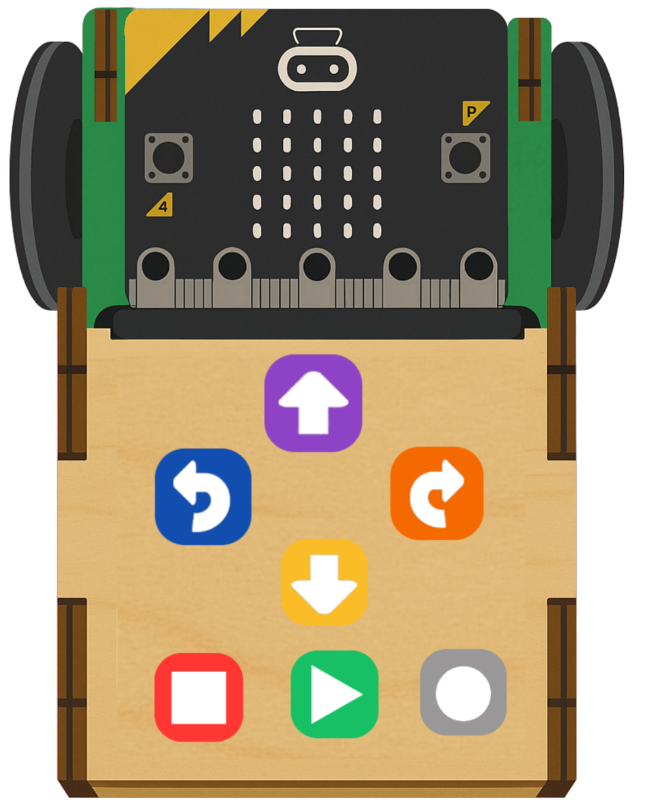

<h1>RoversAIgotchi  </h1>

Here you will find all starter codes and tutorials for the RoversAIgotchi project

---

## 📋 Prerequisites

[Roversa](https://www.roversa.com/home.html) and USB cable

---

## 🗂️ Overview

| # | Project | Description | Concepts Covered |
|---|---------|-------------|------------------|
| 01 | [Getting Started](https://github.com/your-org/microbit-01-getting-started) | Hello world & basic display | LEDs, buttons |
| 02 | [Challenge_1](https://github.com/your-org/microbit-02-traffic-light) | Challenge |  |
| 03 | [Challenge_2](https://github.com/your-org/microbit-03-temperature-sensor) | Challenge |  |
| 04 | [Radio Communication](https://github.com/your-org/microbit-04-radio-communication) | Send messages between Roversas| Radio, events |

---

## 🚀 Getting Started

1. Clone or open the individual project repo linked above
2. Go to [makecode.microbit.org](https://makecode.microbit.org)
3. Click **Import** → **Import URL** and paste the GitHub repo URL
4. Flash to your micro:bit and experiment!

---

## 📁 Repository Structure

Each project follows this structure:
- `README.md` — lesson goals, and MakeCode share link
- `pxt.json` — MakeCode project config
- `main.ts` — source code (TypeScript)
- `assets/` — images and circuit diagrams

---

<!-- ## 🤝 Contributing

Optional — include this if others might contribute.
Describe how to suggest fixes, add lessons, or report issues. -->

---

## 📄 License

[MIT License](LICENSE)